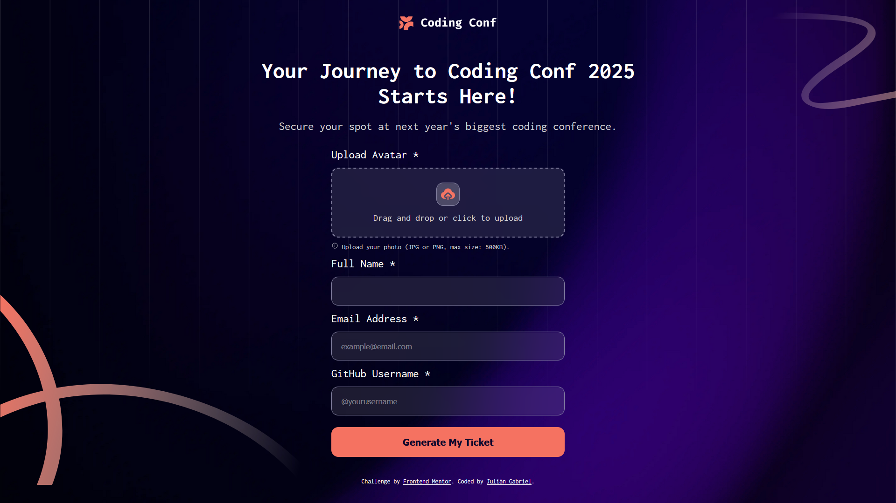
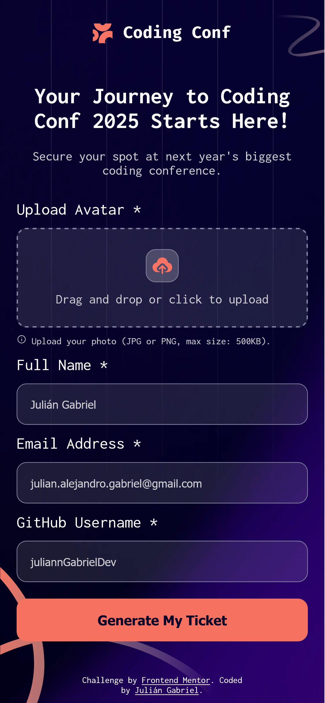
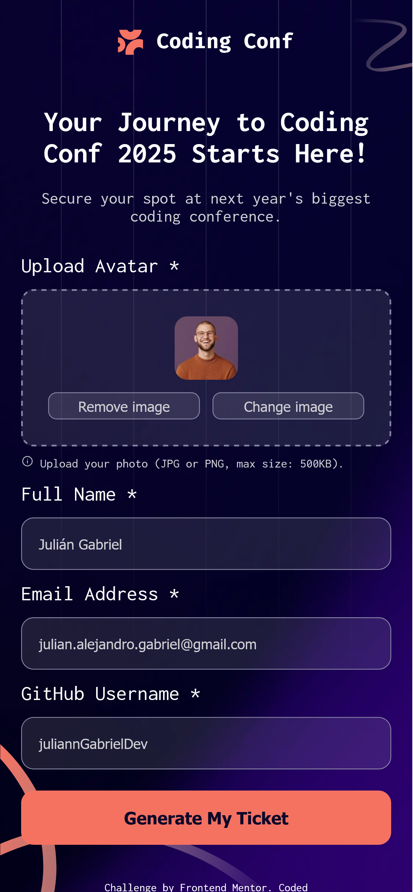
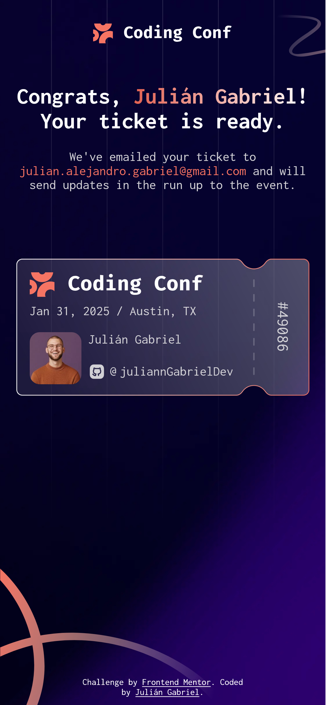

# Frontend Mentor - Conference ticket generator solution

This is a solution to the [Conference ticket generator challenge on Frontend Mentor](https://www.frontendmentor.io/challenges/conference-ticket-generator-oq5gFIU12w). Frontend Mentor challenges help you improve your coding skills by building realistic projects.

## Table of contents

- [Overview](#overview)
  - [The challenge](#the-challenge)
  - [Screenshot](#screenshot)
  - [Links](#links)
- [My process](#my-process)
  - [Built with](#built-with)
  - [What I learned](#what-i-learned)
- [Author](#author)

## Overview

### The challenge

Users should be able to:

- Complete the form with their details
- Receive form validation messages if:
  - Any field is missed
  - The email address is not formatted correctly
  - The avatar upload is too big or the wrong image format
- Complete the form only using their keyboard
- Have inputs, form field hints, and error messages announced on their screen reader
- See the generated conference ticket when they successfully submit the form
- View the optimal layout for the interface depending on their device's screen size
- See hover and focus states for all interactive elements on the page

### Screenshot

#### Desktop



#### Mobile

<p>
    
    
    
</p>

### Links

- Live Site URL: [Add live site URL here](https://your-live-site-url.com)

## My process

### Built with

- Semantic HTML5 markup
- CSS custom properties
- JavaScript event listeners
- JavaScript functions
- JavaScript objects
- JavaScript DOM manipulation
- JavaScript form validation
- Flexbox
- CSS Grid
- Mobile-first workflow

### What I learned

- File type validation
- File size validation
- Manipulation of CSS styles
- Creation of an instance of the FileReader object
- Reading the file as data URL

```js
const handleFile = (file) => {
	resetAvatarDisclaimer();

	if (!file.type.includes("image/")) {
		alert("Please, upload an image file");
		inAvatar.value = "";
		return;
	}
	if (file.size > MAX_SIZE_KB * 1024) {
		showAvatarError("File too large. Please upload a photo under 500KB.");
		return;
	}
	selectedAvatar = file;
	avatarInfo.style.display = "grid";
	avatarInputArea.style.display = "none";

	const reader = new FileReader();
	reader.onload = (e) => {
		imagePreview.src = e.target.result;
		avatarDataUrl = e.target.result;
	};
	reader.readAsDataURL(file);
};
```

## Author

- Julián Alejandro Gabriel Isidro
- Frontend Mentor - [@juliannGabrielDev](https://www.frontendmentor.io/profile/juliannGabrielDev)